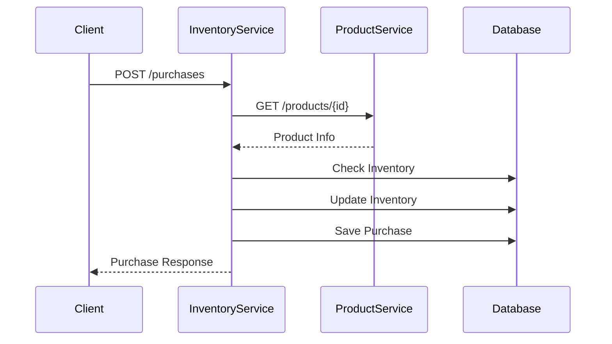

# Microservicio de Inventario - Test Linktic

## 📋 Descripción

Microservicio de gestión de inventario y compras que permite:
- Consultar y actualizar el inventario de productos
- Realizar compras verificando disponibilidad
- Mantener historial de transacciones
- Comunicarse con el microservicio de productos

## 🏗️ Arquitectura

### Diagrama de Componentes

```
┌─────────────────┐    HTTP/JSON    ┌─────────────────┐
│   Product       │ ◄──────────────► │   Inventory     │
│   Service       │   API Key Auth  │   Service       │
└─────────────────┘                 └─────────────────┘
                                             │
                                             ▼
                                    ┌─────────────────┐
                                    │   PostgreSQL    │
                                    │   Database      │
                                    └─────────────────┘
```

### Flujo de Compra



## 🚀 Tecnologías

- **Java 17**
- **Spring Boot 3.2.5**
- **Spring Data JPA**
- **PostgreSQL**
- **OpenFeign** (Comunicación entre servicios)
- **Resilience4j** (Circuit Breaker)
- **SpringDoc OpenAPI** (Documentación)
- **Lombok**

## 📦 Estructura del Proyecto

```
inventory-service/
├── src/main/java/com/testbackend/inventory/
│   ├── client/          # Cliente Feign para Product Service
│   ├── config/          # Configuraciones (Feign, API Keys)
│   ├── controller/      # Controladores REST
│   ├── domain/          # Entidades JPA
│   ├── dto/             # Data Transfer Objects
│   ├── repository/      # Repositorios JPA
│   ├── service/         # Lógica de negocio
│   └── InventoryServiceApplication.java
└── src/main/resources/
    └── application.yml
```

## 🔧 Configuración

### Variables de Entorno

```bash
# Base de Datos
SPRING_DATASOURCE_URL=jdbc:postgresql://localhost:5432/inventory_db
SPRING_DATASOURCE_USERNAME=postgres
SPRING_DATASOURCE_PASSWORD=password

# Servicio de Productos
PRODUCTS_SERVICE_BASE_URL=http://localhost:8081

# API Key para comunicación entre servicios
INTERNAL_API_KEY=your-secret-api-key
```

### Configuración de Feign

- **Timeout**: 1 segundo
- **Reintentos**: 3 intentos
- **Autenticación**: API Key en header `X-INTERNAL-API-KEY`

## 📚 API Documentation

### Swagger UI
Accede a la documentación interactiva en: `http://localhost:8080/swagger-ui.html`

### Endpoints Principales

#### 1. Consultar Inventario
```http
GET /inventory/{productId}
```

**Respuesta:**
```json
{
  "data": {
    "type": "inventory",
    "id": "123e4567-e89b-12d3-a456-426614174000",
    "attributes": {
      "quantity": 50
    }
  }
}
```

#### 2. Actualizar Inventario
```http
PATCH /inventory/{productId}
Content-Type: application/json

{
  "data": {
    "attributes": {
      "quantity": 10
    }
  }
}
```

#### 3. Realizar Compra
```http
POST /purchases
Content-Type: application/json

{
  "productId": "123e4567-e89b-12d3-a456-426614174000",
  "quantity": 5
}
```

**Respuesta:**
```json
{
  "data": {
    "type": "purchase",
    "id": "456e7890-e89b-12d3-a456-426614174001",
    "attributes": {
      "productId": "123e4567-e89b-12d3-a456-426614174000",
      "quantity": 5,
      "unitPrice": 29.99,
      "totalPrice": 149.95,
      "createdAt": "2024-01-15T10:30:00Z"
    }
  }
}
```

## 🎯 Decisiones de Arquitectura

### ¿Por qué el endpoint de compra está en el microservicio de inventario?

**Justificación:**

1. **Responsabilidad de Inventario**: El microservicio de inventario es responsable de gestionar el stock y las transacciones relacionadas con la disponibilidad.

2. **Consistencia de Datos**: Al estar en el mismo servicio, las operaciones de verificación de stock y actualización de inventario se realizan en una sola transacción, garantizando consistencia.

3. **Bajo Acoplamiento**: El servicio de productos mantiene su responsabilidad de gestión de catálogo, mientras que el servicio de inventario maneja las transacciones de compra.

4. **Patrón Saga**: En caso de implementar transacciones distribuidas, el inventario actúa como el coordinador de la saga de compra.

## ⚠️ Manejo de Errores

### Códigos de Error

| Código | Error | Descripción |
|--------|-------|-------------|
| 404 | `PRODUCT_NOT_FOUND` | Producto no existe en el catálogo |
| 404 | `INVENTORY_NOT_FOUND` | No hay registro de inventario para el producto |
| 422 | `INSUFFICIENT_STOCK` | Stock insuficiente para la compra |

### Ejemplo de Error
```json
{
  "timestamp": "2024-01-15T10:30:00Z",
  "status": 422,
  "error": "Unprocessable Entity",
  "message": "INSUFFICIENT_STOCK",
  "path": "/purchases"
}
```

## 🚀 Ejecución

### Prerrequisitos
- Java 17
- PostgreSQL
- Microservicio de productos ejecutándose

### Comandos

```bash
# Compilar
mvn clean compile

# Ejecutar
mvn spring-boot:run

# Ejecutar tests
mvn test
```

## 📊 Monitoreo

### Actuator Endpoints
- Health Check: `GET /actuator/health`
- Info: `GET /actuator/info`
- Metrics: `GET /actuator/metrics`

## 🔮 Mejoras Futuras

### Funcionalidades Opcionales a Implementar

1. **Eventos de Inventario**: Emitir eventos cuando el inventario cambie usando Spring Events o Kafka
2. **Circuit Breaker**: Implementar Resilience4j para manejo de fallos en comunicación con Product Service
3. **Caché**: Implementar Redis para cachear información de productos
4. **Métricas**: Agregar métricas personalizadas con Micrometer
5. **Logging**: Implementar logging estructurado con MDC

### Patrones de Diseño Sugeridos

- **Event Sourcing**: Para auditoría completa de cambios de inventario
- **CQRS**: Separar operaciones de lectura y escritura
- **Saga Pattern**: Para transacciones distribuidas complejas
- **Outbox Pattern**: Para garantizar entrega de eventos

## 👥 Contribución

1. Fork el proyecto
2. Crea una rama para tu feature (`git checkout -b feature/AmazingFeature`)
3. Commit tus cambios (`git commit -m 'Add some AmazingFeature'`)
4. Push a la rama (`git push origin feature/AmazingFeature`)
5. Abre un Pull Request

## 📄 Licencia

Este proyecto está bajo la Licencia MIT - ver el archivo [LICENSE](LICENSE) para detalles.